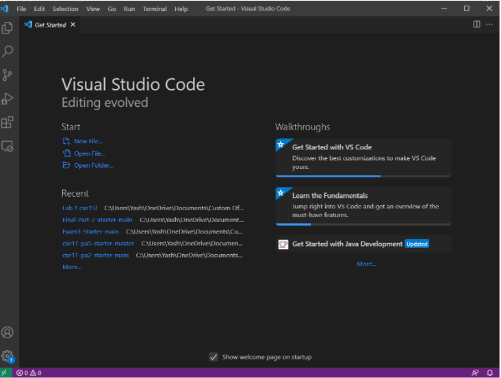
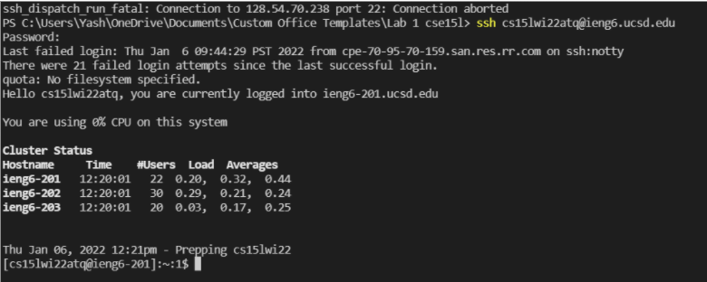
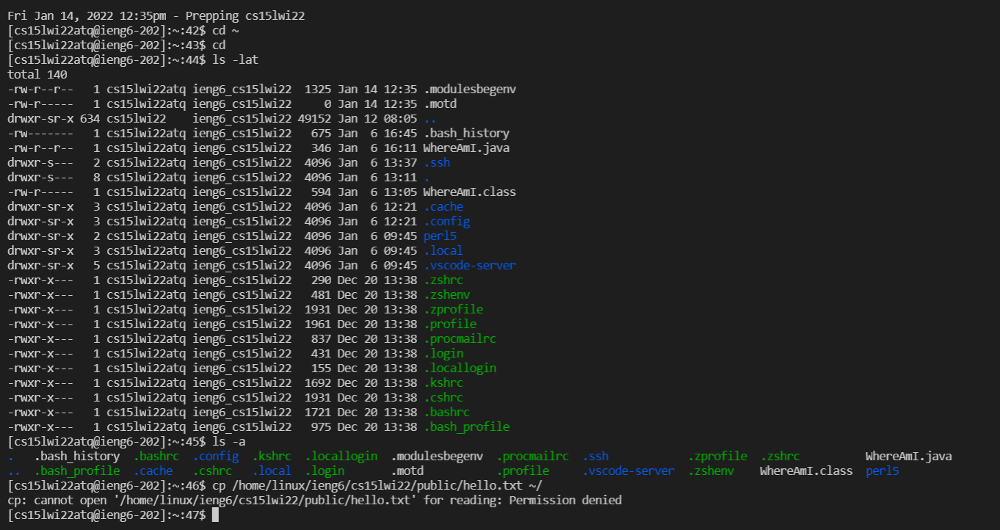
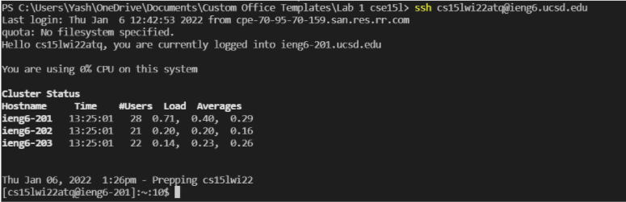
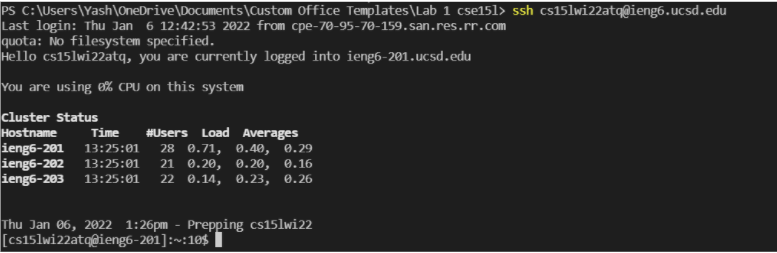
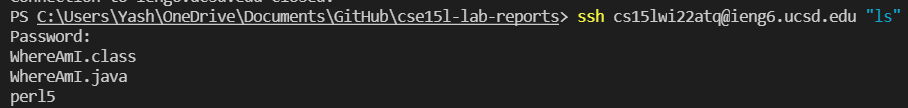

# How To Connect to a SSH Remote Server
## 1. Install VS code onto your device
Follow the installation guide on the follwing [link](https://code.visualstudio.com/). \
When vscode is installed it will look somwething like this. \


## 2. Remotely Connecting
You will have to intall a program called OpenSSH on your device, this helps you connect your computer to other computers. \
Follow this [link](https://docs.microsoft.com/en-us/windows-server/administration/openssh/openssh_install_firstuse) to install OpenSSH and this [link](https://sdacs.ucsd.edu/~icc/index.php) to find your course id. \
Open vscode and open your terminal with ctrl + `. Enter the following command with your user id replacing the xx.

`$ ssh cs15lwi22xx@ieng6.ucsd.edu` \
you will most likely get a weird output like this
```
⤇ ssh cs15lwi22zz@ieng6.ucsd.edu
The authenticity of host 'ieng6.ucsd.edu (128.54.70.227)' can't be established.
RSA key fingerprint is SHA256:ksruYwhnYH+sySHnHAtLUHngrPEyZTDl/1x99wUQcec.
Are you sure you want to continue connecting (yes/no/[fingerprint])? 
```
type yes, and then enter your password 
It should look something like this. \


## 3. Trying Some Commands
You should now try some commands as follows: \
`cd ~` \ 
`cd` \
`ls -lat` \
`ls -a` \
`ls <directory>` where `<directory>` is `/home/linux/ieng6/cs15lwi22/cs15lwi22abc`, where the abc is the part from your username \
`cp /home/linux/ieng6/cs15lwi22/public/hello.txt ~/`
`cat /home/linux/ieng6/cs15lwi22/public/hello.txt` \
It should look something like this \

To disconnect from the remote server you can use the command ctrl + d, or type `exit`.

## 4. Moving Files With `scp`
This is going to be how we copy files from our computer to the remote server. You can create a file on your computer called hello.java with the following code:
```java
System.out.println("Hello, World!");
```
You can try running it using javac and java on your computer. \
To send the file to the remote server run the following command on your terminal of your computer. \
`scp hello.java cs15lwi22zz@ieng6.ucsd.edu:~/` \
Then you will be prompted to login to your ssh again and then you can run the file on the remote server using javac and java. \
If done succesfully it will look like this. \


## 6. SSH Keys
We can set up some keys to better optimize our experience. Entering the password everytime we want to use the server can be painful. SSH keys help us with that. \
Enter the follwing command: \
`$ ssh-keygen`  

On windows you will have to follow some extra steps listed on this [link](https://docs.microsoft.com/en-us/windows-server/administration/openssh/openssh_keymanagement#user-key-generation) \
Then you can create your passphrase.
It create two files on your system, the private key and the public key. \
Copy the public key into the `.ssh` directory of the user account on the server. 
Then you can create your passphrase.
Then you login to the remote server and then you use the command
```
$ mkdir .ssh
$ logout
and back on the client enter this command
$ scp /Users/yash/.ssh/id_rsa.pub cs15lwi22@irng6@ucsd.edu:~/.ssh/authorized_keys
Using your id above^
``` 

After this you should be able to login without a password and it will look like this. 


## 7. Optimizing Remote Running
Some things you can do to make using the server more pleasant are: \
-Using commands at the end of an `ssh` coomand 
```
$ ssh cs15lwi22abc@ieng6.ucsd.edu "ls"
```
Keystroke: To rexecute the command above i used 10 keystrokes. I used the up arrow to reach the ssh command, and 8 more keystrokes to type "ls", and enter to run. 

-You can also use semicolons to run multiple commands on the same line 
```
$ cp hello.java OtherMain.java; javac OtherMain.java; java hello
```
-You can use the up arrow to go the previously used commands in the terminal.



