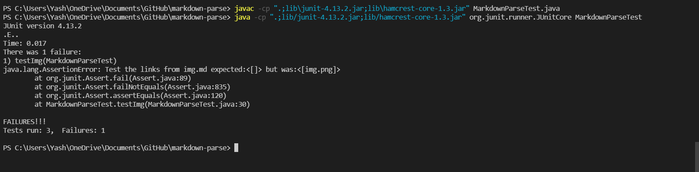
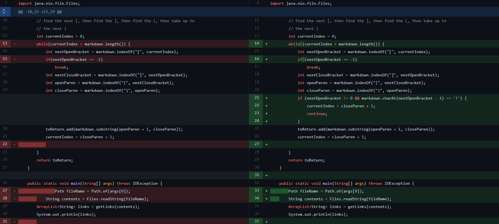
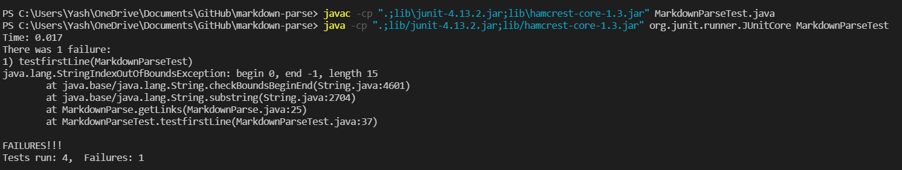
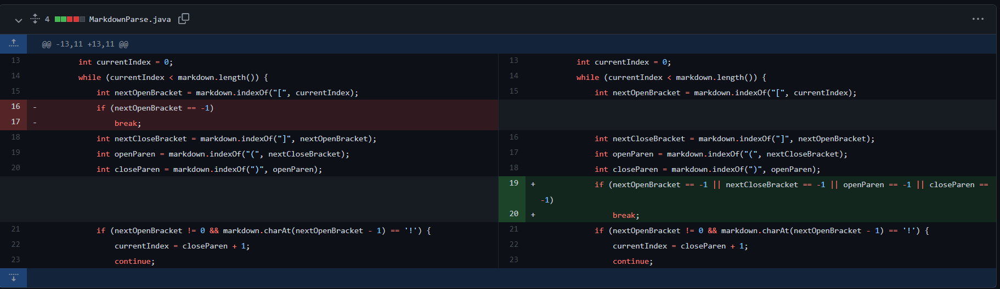
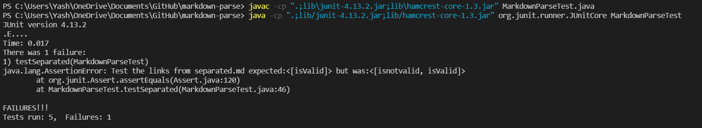
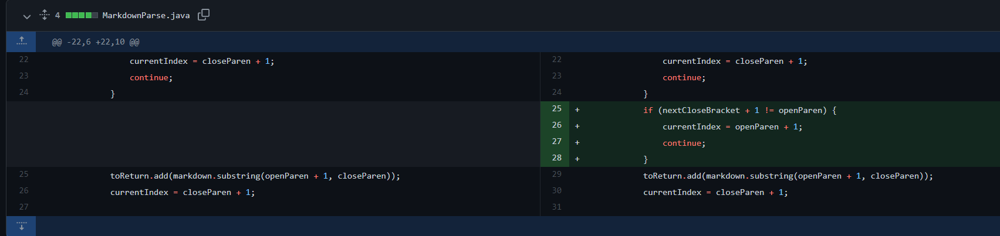

# Lab Report 2 

## First Change:
Upon running [img.md](https://github.com/yash-lol/markdown-parse/blob/main/img.md) with MarkdownParse we get the following error:

To fix this we did the folowing [changes](https://github.com/yash-lol/markdown-parse/commit/bf403221ae09b43d52c8d0be1aec499a6035d268) which led to succesful execution:
 
The bug is that the program didn't check if it was an image link or a normal link,  hence leading our program to believe an image link is a normal link.
> Normal Link : \[link](destination)\
> Image Link : \!\[link](destination) 

An ! before the [ token represents an image

## Second Change
Upon running [firstline.md](https://github.com/yash-lol/markdown-parse/blob/main/firstline.md) with MarkdownParse we get the following error:

To fix this we did the folowing [changes](https://github.com/yash-lol/markdown-parse/commit/c1da77597319bf816c90f5c851b4619618ce5614) which led to succesful exectution:
    
The bug is that the program didnt check if the [ ] or ( ) pairs were present or complete. 

## Third Change
Upon running [separated.md](https://github.com/yash-lol/markdown-parse/blob/main/separated.md) with MarkdownParse we get the following error:

To fix this we made the following [changes](https://github.com/yash-lol/markdown-parse/commit/f1671995d55fdd6113aeede6de10cf1365d9e50f) with MarkdownParse we get the following error:

The bug is that the program didnt check if the ] and ( had any characters in between them. 