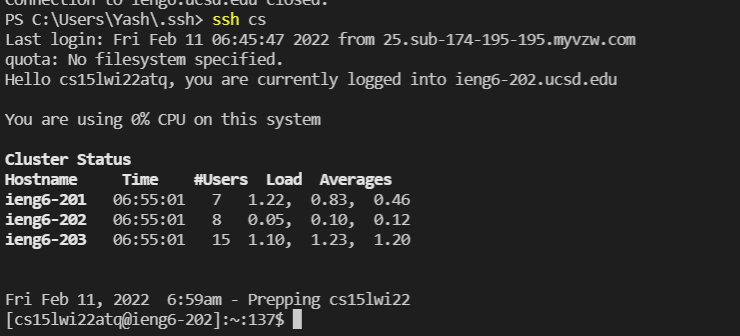

# Lab Report 3
## Streamlining SSH configuration

### Step 1: Editing the config file
Create a config file in the .ssh/ folder and edit it on the text editor of your choice. \
Paste the following code on your code editor:
```
Host <alias>
  HostName ieng6.ucsd.edu
  User cs15lwi22zzz     --> zzz should be replaced by your username
  IdentityFile <Path to the private key part of the key pair used for this ssh port> --> Optional
```
In my case:


### Step 2: Using ssh with your alias
Then you enter the following command and enter your password:

```
$ ssh <alias>
```
However if you set up the IdentityFile you would most likely not need your password to login. 

I chose my alias to be `cs` 



### Step 3: Using the alias with an scp command

You then copy a file to your account using the new alias with the scp command. You replace your username with the alias and then enter your password.
The original command and full username look like this

Instead of 

```
$ scp <transfer_file> cs15lwi22zzz@ieng6.ucsd.edu:~/
```
we do
```
$ scp <transfer_file> <your_alias>:~/
```

I used `scp -r` to transfer mulpitple files recursively


