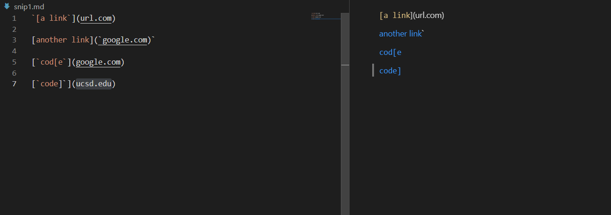
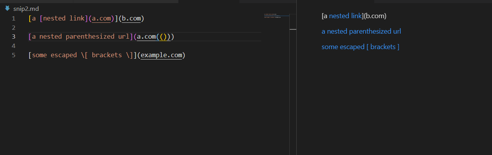
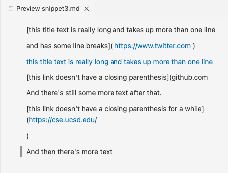
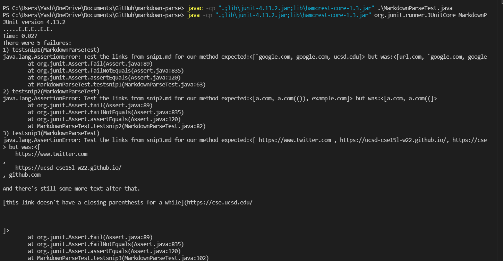
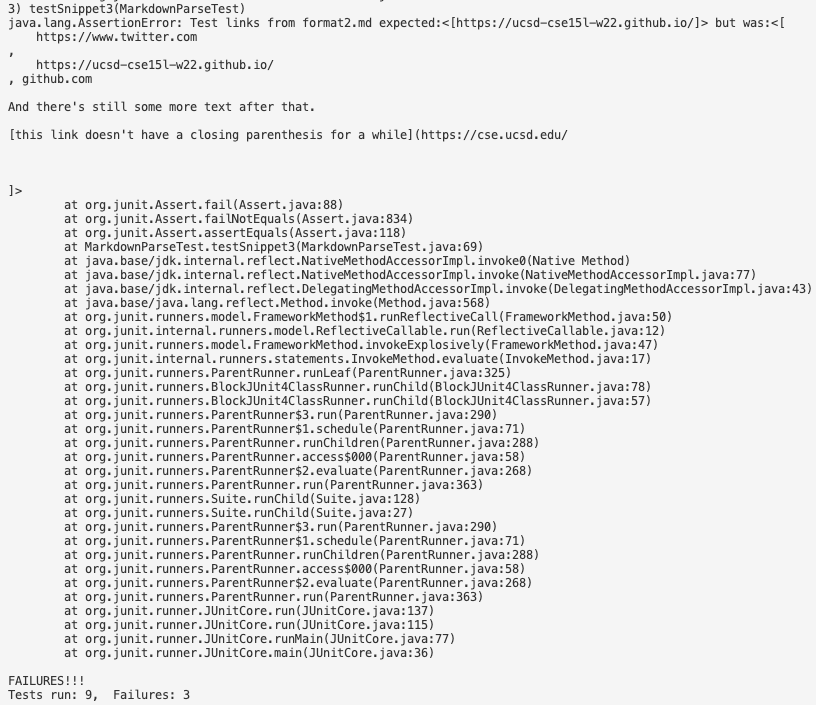
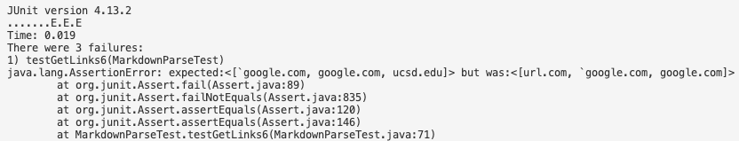
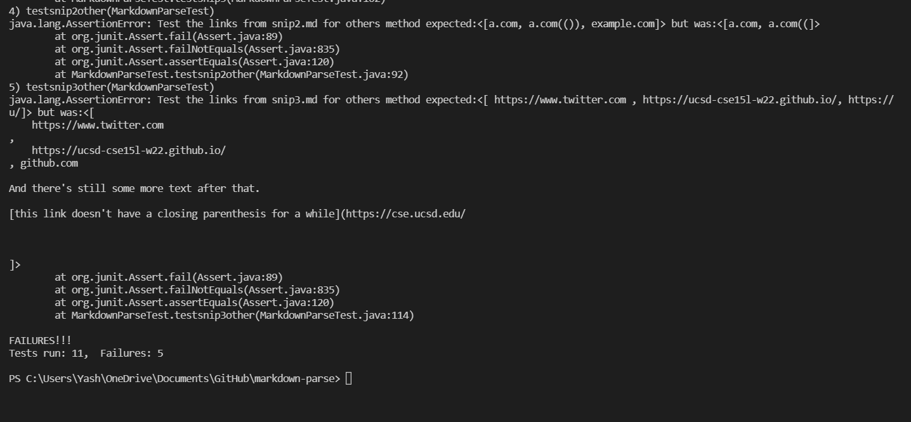
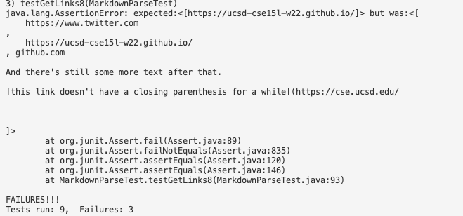

# Lab Report 4

## Links:
[my markdown parse](https://github.com/yash-lol/markdown-parse) \
[peer review markdown parse](https://github.com/johnsonli010801/markdown-parse)

### Snip 1


### Snip 2


### Snip 3


## Tests
```java
 @Test
    public void testsnip1() throws IOException {
        Path fileName = Path.of("snip1.md");
        String contents = Files.readString(fileName);
        ArrayList<String> ourLinks = MarkdownParse.getLinks(contents);

        assertEquals("Test the links from snip1.md for our method", List.of("`google.com", "google.com", "ucsd.edu"),
                ourLinks);

    }

    public void testsnip1other() throws IOException {
        Path fileName = Path.of("snip1.md");
        String contents = Files.readString(fileName);
        ArrayList<String> otherLinks = MarkdownParse.getLinksOther(contents);

        assertEquals("Test the links from snip1.md for others method", List.of("`google.com", "google.com", "ucsd.edu"),
                otherLinks);
    }

    @Test
    public void testsnip2() throws IOException {
        Path fileName = Path.of("snip2.md");
        String contents = Files.readString(fileName);
        ArrayList<String> ourLinks = MarkdownParse.getLinks(contents);

        assertEquals("Test the links from snip2.md for our method", List.of("a.com", "a.com(())", "example.com"),
                ourLinks);
    }

    @Test
    public void testsnip2other() throws IOException {
        Path fileName = Path.of("snip2.md");
        String contents = Files.readString(fileName);
        ArrayList<String> otherLinks = MarkdownParse.getLinksOther(contents);

        assertEquals("Test the links from snip2.md for others method", List.of("a.com", "a.com(())", "example.com"),
                otherLinks);
    }

    @Test
    public void testsnip3() throws IOException {
        Path fileName = Path.of("snip3.md");
        String contents = Files.readString(fileName);
        ArrayList<String> ourLinks = MarkdownParse.getLinks(contents);

        assertEquals("Test the links from snip3.md for our method",
                List.of("https://ucsd-cse15l-w22.github.io/", links);

    }

    @Test
    public void testsnip3other() throws IOException {
        Path fileName = Path.of("snip3.md");
        String contents = Files.readString(fileName);
        ArrayList<String> otherLinks = MarkdownParse.getLinksOther(contents);

         assertEquals("Test the links from snip3.md for our method",
                List.of("https://ucsd-cse15l-w22.github.io/", links);
    }
}

```
### My output

snip 3

### Peer output
snip 1



snip 3


## Questions

1. Do you think there is a small (<10 lines) code change that will make your program work for snippet 1 and all related cases that use inline code with backticks? If yes, describe the code change. If not, describe why it would be a more involved change. \
-->Yes, we can check if the square brackets are between backticks on the same line. 

2. Do you think there is a small (<10 lines) code change that will make your program work for snippet 2 and all related cases that nest parentheses, brackets, and escaped brackets? If yes, describe the code change. If not, describe why it would be a more involved change. \
--> No, all of them require individual loops and counters, and this would take mroe than 10 lines.  

3. Do you think there is a small (<10 lines) code change that will make your program work for snippet 3 and all related cases that have newlines in brackets and parentheses? If yes, describe the code change. If not, describe why it would be a more involved change. \
--> Yes, we can trim the output and if it's more than one line, we continue and reject the output. This should take about 5 lines. 

