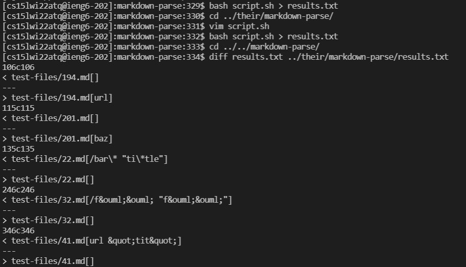
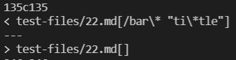
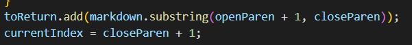
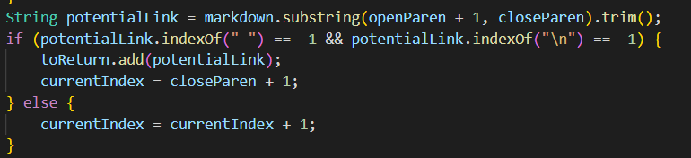
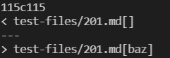
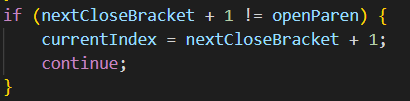
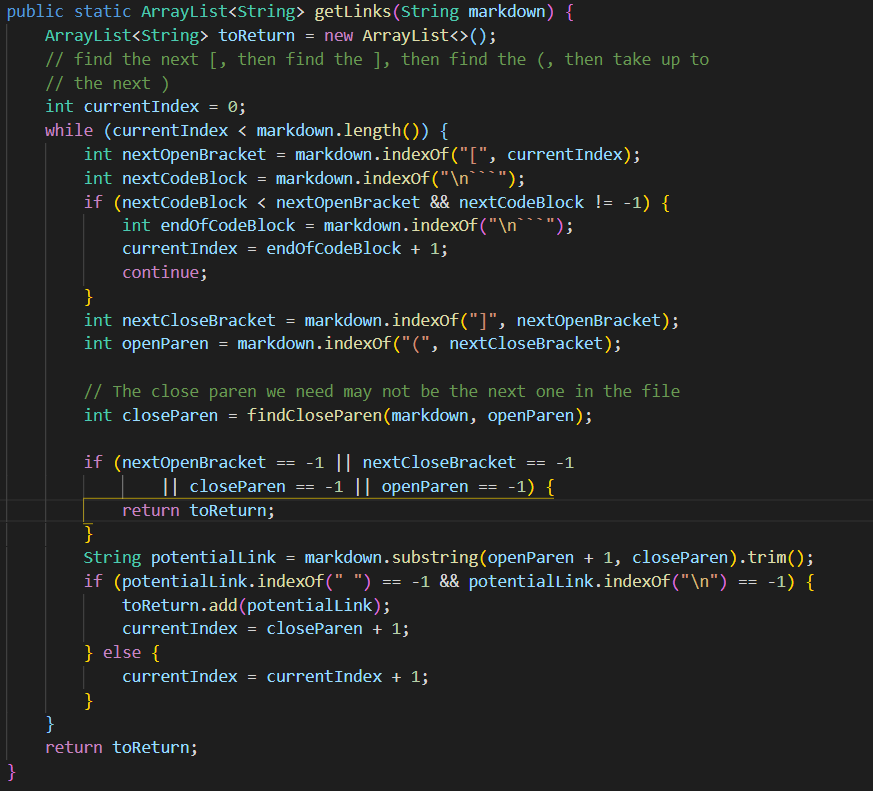

# Lab Report 5
## Test File 1 **22.md**
**22.md** File Content \
```[foo](/bar\* "ti\*tle")``` 

### Expected output
For this test the output should be `[ "/bar*" ]` when hovered over we get `ti*tle` because the first input inside the parenthesis is the link, and the second inside quotes is the hover-over text. 

### How we compared results
To get the **results.txt** file in each repository I ran \
`bash script.sh > results.txt` 
where the script file was 
```bash
for file in test-files/*.md;
do
    echo $file
    java MarkdownParse $file
    
done
```
I used diff to test the different results. \
```diff results.txt ../their/markdown-parse/results.txt``` \
Where the first argument is my results and the second one is the program given to us in week 9.



### The output obtained
My implementation on **22.md** returned 
```[/bar\* "ti\*tle"]```

whereas the week 9 implementation returned ```[]```, an empty array



### Conclusion and fixes
In this case both are wrong, but my implementation could be fixed by adding a split statement on the substring, checking if the second param is a valid string and passing the first element i.e. if the substring follows ```<link> ["optional hover text"]``` where the quotes are necessary.



The week 9 code disregards any link if it contains a space even if it can be a valid link with one. It could be fixed by a method similar to the one specified above.


## Test File 2 **201.md**
**201.md** File Content 
```
[foo]: <bar>(baz)

[foo]
``` 
### Expected output
For this test there is no valid link as there are characters between the brackets and parentheses and the second one is missing a parentheses. The method should return an empty array.

### The output obtained
My implementation returned an empty array `[]`

and the week 9 implementation returned `[baz]`



### Conclusion and fixes
I can conclude that my implementation was correct as it returned the right array. I accomplished this by checking if the closing bracket and open parentheses were concurrent.



However the week 9 code never checks for concurrency and adds the link in parentheses to the array. It can be fixed by adding the statement above before the code adds the link to the array.

